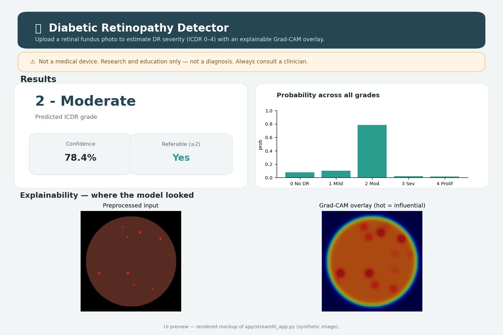
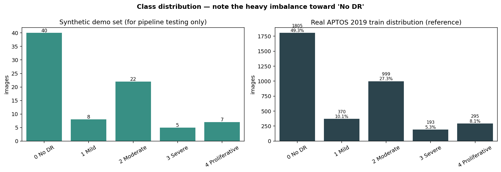
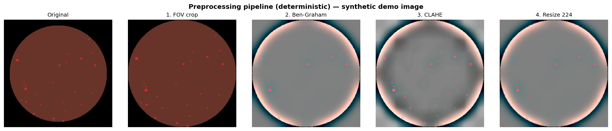
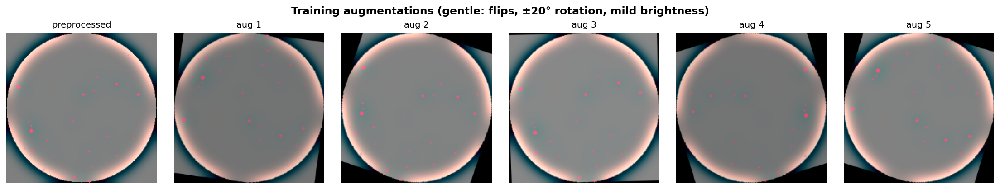
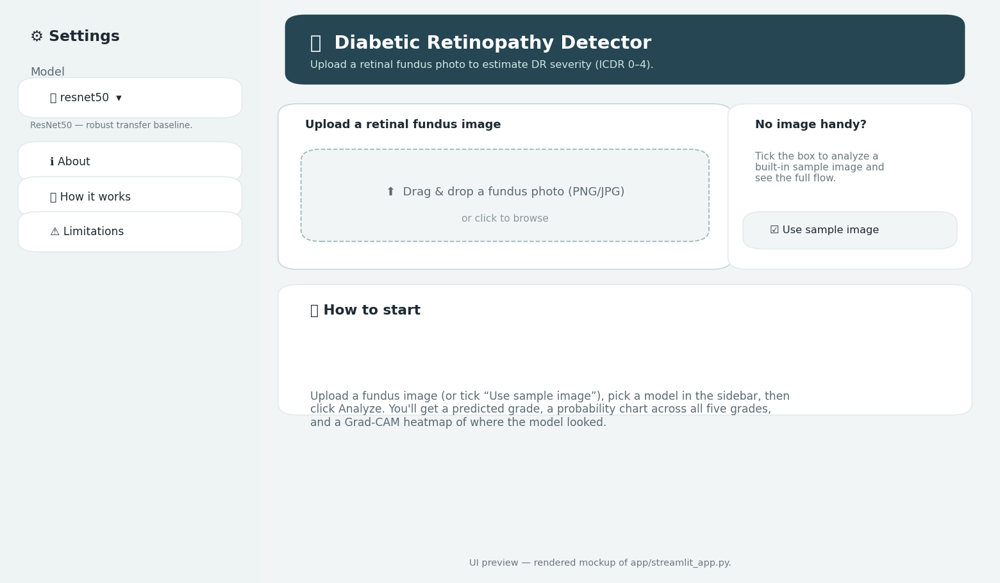

# Deep Learning for Early Detection of Diabetic Retinopathy

[](https://github.com/RohinDaCoder23/Diabetic-Retinopathy-Application/actions/workflows/ci.yml)
[](https://www.python.org/)
[](LICENSE)


> ⚠️ **NOT A MEDICAL DEVICE.** This is a research and education project. It makes
> **no clinical claims** and must **not** be used to diagnose, screen, or treat
> any person. Always consult a qualified clinician.

A reproducible image-classification pipeline that grades retinal fundus
photographs for diabetic retinopathy (DR) on the ICDR 0–4 scale. It compares a
**custom CNN built from scratch** against **transfer-learning models**
(ResNet50, EfficientNet, DenseNet121), explains predictions with **Grad-CAM**,
and ships a polished **Streamlit** web app — all organized as a professional,
reproducible repository.



---

## Table of contents
1. [Motivation](#motivation)
2. [Dataset](#dataset)
3. [Pipeline](#pipeline)
4. [Results](#results)
5. [The app](#the-app)
6. [How to run](#how-to-run)
7. [Testing](#testing)
8. [Repository structure](#repository-structure)
9. [Reproducibility](#reproducibility)
10. [Ethics & limitations](#ethics--limitations)
11. [Acknowledgements](#acknowledgements)
12. [License](#license)

---

## Motivation
Diabetic retinopathy is a leading cause of preventable blindness, and it is
*screenable* from a single retinal photo. This project explores how deep
learning can grade DR severity, **as a learning exercise** — building the full
machine-learning lifecycle end to end and explaining every step (see
[`docs/concepts.md`](docs/concepts.md)).

## Dataset
**APTOS 2019 Blindness Detection** (~3,662 labeled fundus images, ICDR grades
0–4). The data is **not** included in this repo. See
[`data/README.md`](data/README.md) for download steps and the exact folder
layout the code expects. The dataset is heavily imbalanced toward "No DR":



The ICDR scale is **ordinal** (0 No DR → 4 Proliferative); "**referable DR**"
(grade ≥ 2) is the decision-relevant binary view.

## Pipeline
`data → preprocess → augment → train → evaluate → explain → serve`
(full diagram + per-step rationale in [`docs/pipeline.md`](docs/pipeline.md)).

Deterministic preprocessing standardizes every image (FOV crop → Ben-Graham →
resize → ImageNet normalize):



Training augmentations are deliberately gentle so tiny lesions survive:



## Results
The headline DR metric is **Quadratic Weighted Kappa (QWK)** — it respects the
ordinal scale and survives class imbalance, unlike raw accuracy. Run training +
evaluation (below), then open [`notebooks/03_results.ipynb`](notebooks/03_results.ipynb)
to regenerate the table and figures.

> The table below is a **template** — fill in with your numbers after training on
> the real APTOS data. (No results are fabricated here.)

| Model            | QWK  | Accuracy | Macro-F1 | Macro ROC-AUC | Referable recall |
|------------------|:----:|:--------:|:--------:|:-------------:|:----------------:|
| Custom CNN       |  —   |    —     |    —     |       —       |        —         |
| ResNet50         |  —   |    —     |    —     |       —       |        —         |
| EfficientNet-B0  |  —   |    —     |    —     |       —       |        —         |
| DenseNet121      |  —   |    —     |    —     |       —       |        —         |

`evaluate.py` also writes confusion matrices and ROC curves to
`reports/figures/`. **Why not lead with accuracy?** With ~49% "No DR", a model
that always predicts healthy scores ~49% accuracy while catching *zero* patients
— so we lead with QWK and watch referable-DR recall.

## The app
A polished Streamlit app: upload a fundus image, pick a model, and get a graded
prediction with a probability chart and a Grad-CAM overlay.



```bash
streamlit run app/streamlit_app.py
```
*(Screenshots above are rendered UI previews; run the app to see the live
version once you have trained weights in `models/`.)*

## How to run

### Fastest path — one click on Colab
Open [`notebooks/run_all_colab.ipynb`](notebooks/run_all_colab.ipynb) in Google
Colab, set the runtime to **GPU**, and choose **Runtime → Run all**. It walks the
whole pipeline for you: install → self-test → download APTOS (Kaggle) → smoke-test
→ train → evaluate → Grad-CAM → save. That is the recommended way to run this project.

The manual steps below are the same thing, broken out, for running locally or if you
prefer to go cell by cell.

### 1. Get the code and install dependencies
```bash
git clone https://github.com/RohinDaCoder23/Diabetic-Retinopathy-Application.git
cd Diabetic-Retinopathy-Application
pip install -r requirements.txt -r requirements-dev.txt   # or: conda env create -f environment.yml
```

### 2. Add the data
Follow [`data/README.md`](data/README.md) to download APTOS 2019 into
`data/aptos2019/`.

### 3. Run order
```bash
# 1. Explore the data
jupyter notebook notebooks/01_eda.ipynb

# 2. Visualize preprocessing & augmentation
jupyter notebook notebooks/02_preprocessing.ipynb

# 3. Train (always smoke-test first; a GPU is strongly recommended)
python src/train.py --config config.yaml --model resnet50 --smoke-test   # 1-epoch sanity check
python src/train.py --config config.yaml --model resnet50
python src/train.py --config config.yaml --model efficientnet_b0
python src/train.py --config config.yaml --model densenet121
python src/train.py --config config.yaml --model custom_cnn

# 4. Evaluate each model on the held-out test set
python src/evaluate.py --config config.yaml --model resnet50

# 5. Generate Grad-CAM explanations
python src/gradcam.py --config config.yaml --model resnet50

# 6. Build the comparison table + figures
jupyter notebook notebooks/03_results.ipynb

# 7. Launch the app
streamlit run app/streamlit_app.py
```

> **Compute:** training is intended for **Google Colab** (GPU runtime). Exact,
> copy-paste Colab instructions (incl. Kaggle download + smoke test) are in
> [`docs/colab_quickstart.md`](docs/colab_quickstart.md).

## Testing

The project ships with a real test suite so you can prove the code works before
(and without) training on the full dataset. **All tests use a tiny synthetic
dataset generated on the fly — no APTOS download needed.**

```bash
# Zero-dependency smoke check (numpy/opencv/pandas/pyyaml only):
python tests/run_offline_checks.py

# Full suite (needs the project deps + pytest):
pip install -r requirements.txt -r requirements-dev.txt
pytest -m "not slow"     # fast unit tests (preprocess, models, transforms, splits)
pytest                   # everything, incl. end-to-end train -> evaluate -> inference -> Grad-CAM
```

Tests that need an unavailable library **skip** instead of failing, and transfer
models are built with `pretrained=False`, so the suite never hits the network.
See [`tests/README.md`](tests/README.md) for the full coverage map.

**Continuous integration:** [`.github/workflows/ci.yml`](.github/workflows/ci.yml)
runs the offline checks *and* the complete pytest suite (end-to-end pipeline on
synthetic data, CPU-only) on every push and pull request — the green CI badge at
the top means a fresh clone still runs correctly.

## Repository structure
```
diabetic-retinopathy/
├── README.md              ← you are here
├── requirements.txt       ← pinned dependencies
├── requirements-dev.txt   ← dev/test deps (pytest)
├── environment.yml        ← optional conda environment
├── pytest.ini             ← test configuration
├── config.yaml            ← all tunable settings (the single source of truth)
├── CHANGELOG.md           ← version history
├── .gitignore · LICENSE (MIT)
├── data/                  ← (gitignored) dataset goes here; see data/README.md
├── notebooks/
│   ├── run_all_colab.ipynb     ← ONE-CLICK: download → train → evaluate → results
│   ├── 01_eda.ipynb            ← class distribution, samples, quality, splits
│   ├── 02_preprocessing.ipynb  ← before/after preprocessing + augmentation
│   └── 03_results.ipynb        ← comparison table, confusion grid, ROC curves
├── src/
│   ├── data.py            ← Dataset, DataLoaders, stratified split, sampler, class weights
│   ├── preprocess.py      ← FOV crop, Ben-Graham, CLAHE, resize
│   ├── augment.py         ← Albumentations train/eval pipelines + normalize
│   ├── models/
│   │   ├── __init__.py    ← build_model() factory + Grad-CAM target lookup
│   │   ├── custom_cnn.py  ← from-scratch CNN (~0.39M params)
│   │   └── transfer.py    ← ResNet50 / EfficientNet-B0/B3 / DenseNet121 builders
│   ├── train.py           ← training loop (weighted/focal loss, AdamW, sched, AMP, early stop)
│   ├── evaluate.py        ← metrics + figures (incl. QWK)
│   ├── gradcam.py         ← Grad-CAM heatmaps
│   ├── inference.py       ← single-image inference shared by the app
│   └── utils.py           ← seeds, config, logging, checkpoints, plots
├── app/
│   ├── streamlit_app.py   ← the web app
│   ├── assets/            ← sample image
│   └── .streamlit/config.toml  ← app theme
├── models/                ← (gitignored) saved weights
├── reports/figures/       ← generated plots, confusion matrices, Grad-CAM, screenshots
├── tests/                 ← pytest suite + zero-dep offline checks
├── .github/workflows/     ← CI (runs tests on every push)
└── docs/
    ├── concepts.md            ← plain-language explanation of EVERY concept
    ├── pipeline.md            ← end-to-end pipeline + WHY notes
    ├── colab_quickstart.md    ← exact Colab run instructions
    ├── ethics_limitations.md  ← ethics, limitations, future work
    └── presentation_notes.md  ← slide outline + Q&A to rehearse
```

## Reproducibility
- **Pinned** dependencies (`requirements.txt`).
- **Fixed seed** applied everywhere via `src/utils.py:set_seed()` (value in `config.yaml`).
- **One config** (`config.yaml`) drives every script.
- **Documented run order** (above), so a fresh clone reproduces results.
- **Stratified, seed-fixed** train/val/test split; test set touched only once.
- **Tested + CI**: `pytest` suite runs the whole pipeline on synthetic data; CI runs it on every push.

## Ethics & limitations
This is **not** a medical device and has **no** clinical validation. See
[`docs/ethics_limitations.md`](docs/ethics_limitations.md) for the full
discussion (dataset/demographic bias, automation bias, privacy, regulation, and
limitations such as single-source data and image-quality dependence).

## Acknowledgements
- APTOS 2019 Blindness Detection (Kaggle) for the dataset.
- The PyTorch, torchvision, Albumentations, scikit-learn, and pytorch-grad-cam
  open-source projects.

## License
[MIT](LICENSE) © 2026 Ron.
